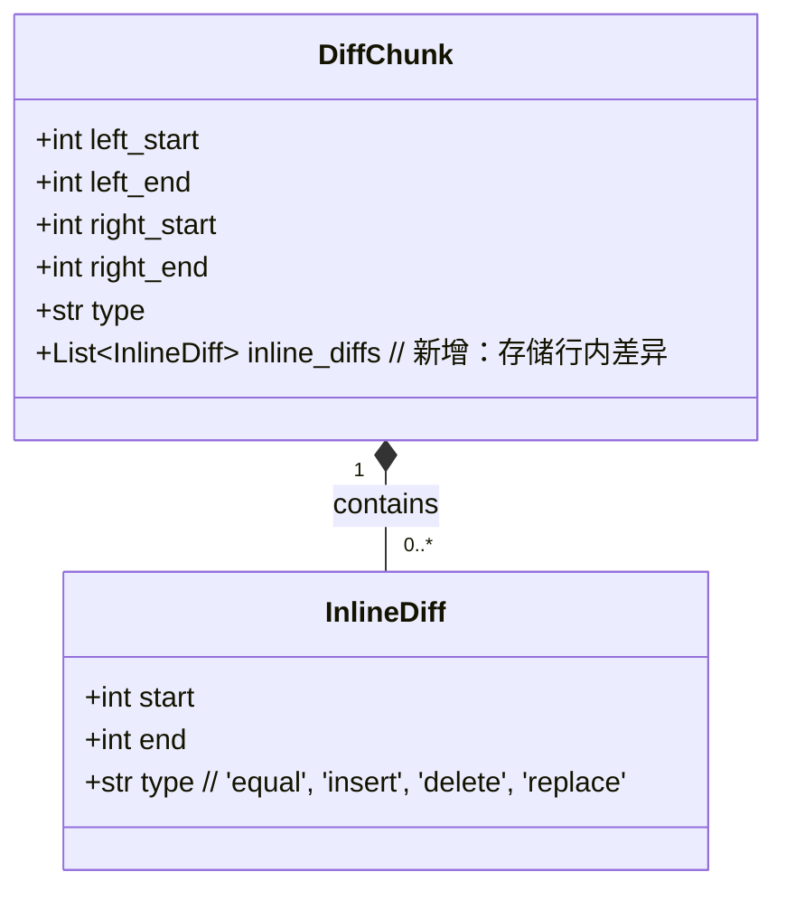

# 差异比较功能改进计划

## 目标
实现更精细的差异比较，例如识别单个空格的增减。

## 现有机制总结

*   **`diff_highlighter.py`**: 当前的高亮逻辑是行级别的，通过 `setFormat(0, len(text), format)` 对整行应用格式。
*   **`diff_calculator.py`**: `DifflibCalculator` 使用 `difflib.SequenceMatcher` 的 `get_opcodes()`，它只提供行范围的差异。`DiffChunk` 也只存储行范围。
*   **`text_diff_viewer.py`**: `DiffViewer` 和 `MergeDiffViewer` 都依赖于 `DiffCalculator` 返回的行级别 `DiffChunk`，并将其直接传递给高亮器。

## 详细计划

### 1. 扩展 `DiffChunk` 类 (`diff_calculator.py`)

为了支持行内差异，`DiffChunk` 需要能够存储每个差异行内部的字符级别差异。



*   **修改 `DiffChunk`**:
    *   在 `DiffChunk` 中添加一个新字段 `inline_diffs: List[InlineDiff]`，默认为空列表。
*   **定义 `InlineDiff`**:
    *   创建一个新的 `dataclass` `InlineDiff`，包含 `start: int`, `end: int`, `type: str`。

### 2. 修改 `DifflibCalculator` (`diff_calculator.py`)

`DifflibCalculator` 需要在计算出行级别的 `'replace'` 差异块后，对这些块内的文本进行字符级别的二次比较。

```mermaid
graph TD
    A[compute_diff(left_text, right_text)] --> B{Split texts into lines}
    B --> C[difflib.SequenceMatcher (line-level)]
    C --> D{Iterate line-level opcodes}
    D --> E{If opcode is 'replace'}
    E --> F[Extract corresponding lines]
    F --> G[difflib.SequenceMatcher (char-level) for these lines]
    G --> H{Iterate char-level opcodes}
    H --> I[Create InlineDiff objects]
    I --> J[Add InlineDiffs to DiffChunk.inline_diffs]
    E --> K{If opcode is 'insert'/'delete'/'equal'}
    K --> L[Create DiffChunk (no inline_diffs)]
    J --> M[Append DiffChunk to list]
    L --> M
    M --> N[Return list of DiffChunks]
```

*   **修改 `DifflibCalculator.compute_diff`**:
    *   在现有的行级别 `difflib.SequenceMatcher` 循环中，当 `tag` 为 `'replace'` 时：
        *   提取 `left_lines[i1:i2]` 和 `right_lines[j1:j2]` 对应的文本。
        *   对这些文本进行字符级别的 `difflib.SequenceMatcher` 比较。
        *   遍历字符级别的 `opcodes`，为每个操作创建 `InlineDiff` 对象。
        *   将这些 `InlineDiff` 对象添加到当前 `DiffChunk` 的 `inline_diffs` 列表中。
    *   对于 `'insert'`, `'delete'`, `'equal'` 类型的差异块，`inline_diffs` 列表将保持为空。

### 3. 修改 `DiffHighlighterEngine` (`diff_highlighter.py`)

`DiffHighlighterEngine` 需要能够识别并应用行内差异的高亮。

```mermaid
graph TD
    A[highlightBlock(text)] --> B{Get block_number}
    B --> C{Find current_chunk based on block_number and editor_type}
    C --> D{If current_chunk exists and type is not 'equal'}
    D --> E{Apply line-level format (background color)}
    E --> F{If current_chunk.inline_diffs exists and is not empty}
    F --> G{Iterate through inline_diffs}
    G --> H[Apply char-level format (e.g., underline, different foreground color) using setFormat(start, length, format)]
    H --> I[Continue to next inline_diff]
    I --> J[End of highlightBlock]
    F --> J
    D --> J
    C --> J
```

*   **修改 `DiffHighlighterEngine.highlightBlock`**:
    *   在应用行级别高亮（背景色）之后，检查 `current_chunk.inline_diffs` 是否存在且不为空。
    *   如果存在行内差异，遍历 `inline_diffs` 列表。
    *   对于每个 `InlineDiff`，根据其 `type`（'insert', 'delete', 'replace'）创建或获取一个字符格式（例如，下划线、不同的前景色）。
    *   使用 `self.highlighter.setFormat(inline_diff.start, inline_diff.end - inline_diff.start, inline_format)` 对行内特定范围的字符应用字符级别的高亮。
*   **定义新的高亮格式**:
    *   在 `DiffHighlighterEngine` 中定义新的 `QTextCharFormat`，用于表示行内插入、删除和替换的字符级别高亮。例如，可以使用下划线或不同的前景色来区分。

### 4. 更新 `text_diff_viewer.py` (少量修改)

`text_diff_viewer.py` 中的主要逻辑不需要改变，因为它已经将 `DiffChunk` 传递给了高亮器。唯一可能需要调整的是，如果新的 `DiffChunk` 结构导致任何现有逻辑中断，或者需要调整滚动逻辑以更好地适应行内差异（尽管这通常不是必需的，因为滚动仍然是基于行的）。

*   **确认兼容性**: 确保 `set_diff_chunks` 和 `_compute_diff` 等方法能够无缝处理新的 `DiffChunk` 结构。由于 `inline_diffs` 是一个新增字段，并且默认为空，现有代码应该能够兼容。

### 5. 添加中文注释

*   在所有修改和新增的代码中，添加清晰的中文注释。

### 6. 测试

*   在完成修改后，需要进行彻底的测试，以确保行内差异高亮功能正常工作，并且没有引入新的问题。

**Mermaid 图示：**

```mermaid
graph TD
    subgraph DiffCalculator.py
        A[DiffChunk] --> B[InlineDiff]
        C[DifflibCalculator.compute_diff] --> D{Line-level diff}
        D -- "If 'replace'" --> E{Char-level diff}
        E --> F[Populate DiffChunk.inline_diffs]
    end

    subgraph DiffHighlighter.py
        G[DiffHighlighterEngine.highlightBlock] --> H{Apply line-level format}
        H -- "If inline_diffs exist" --> I{Iterate inline_diffs}
        I --> J[Apply char-level format]
    end

    subgraph TextDiffViewer.py
        K[DiffViewer._compute_diff] --> C
        C --> G
    end

    K -- "Calls" --> C
    C -- "Returns DiffChunks" --> G